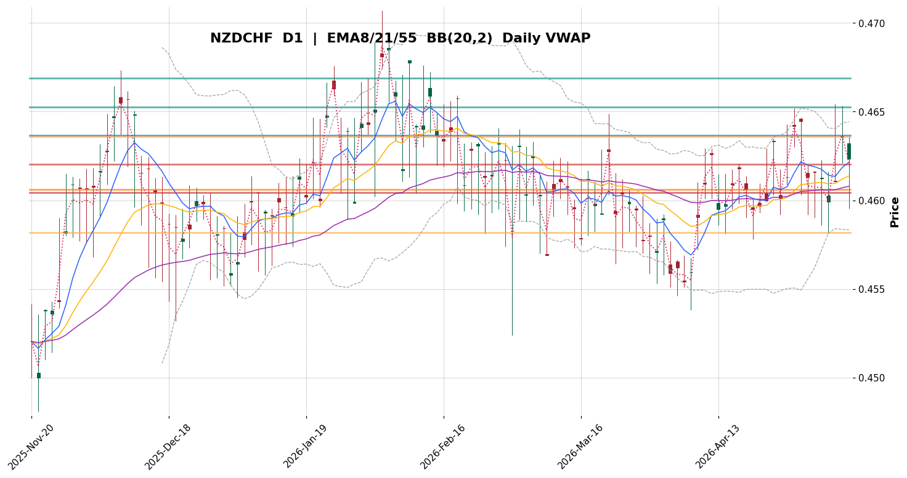
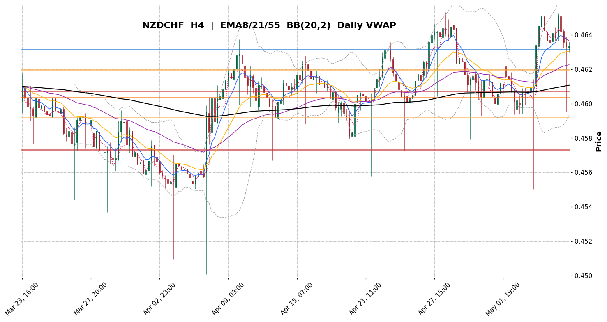
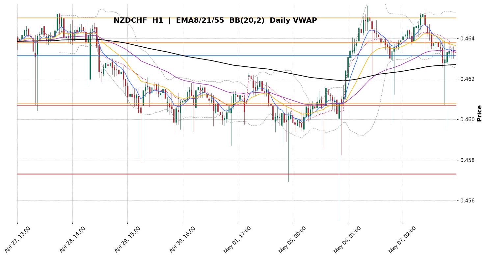
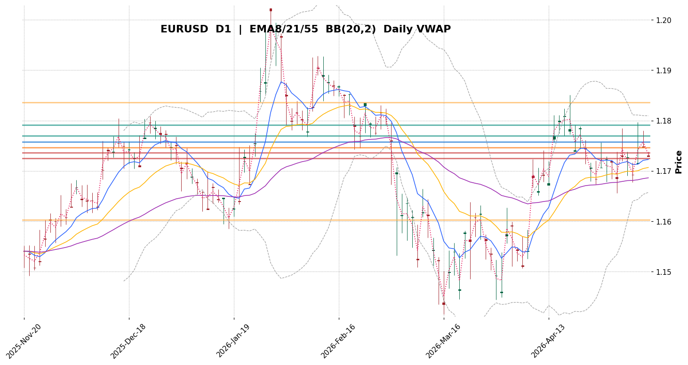
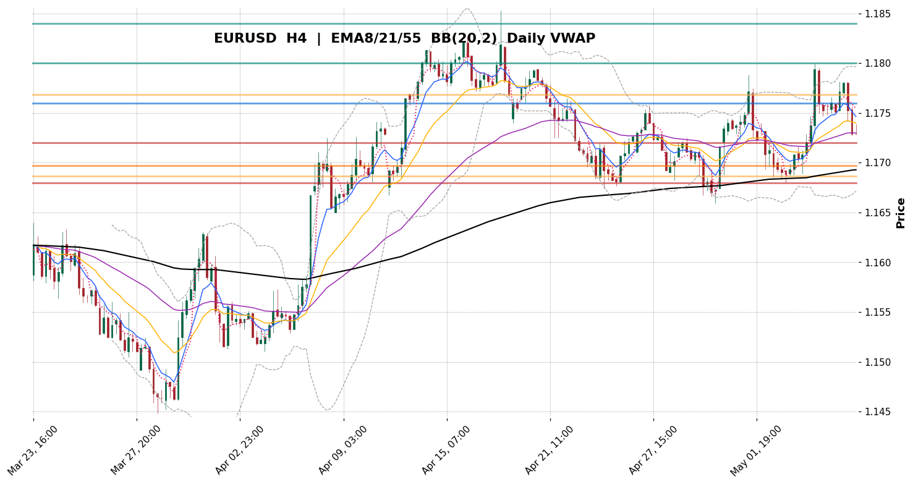
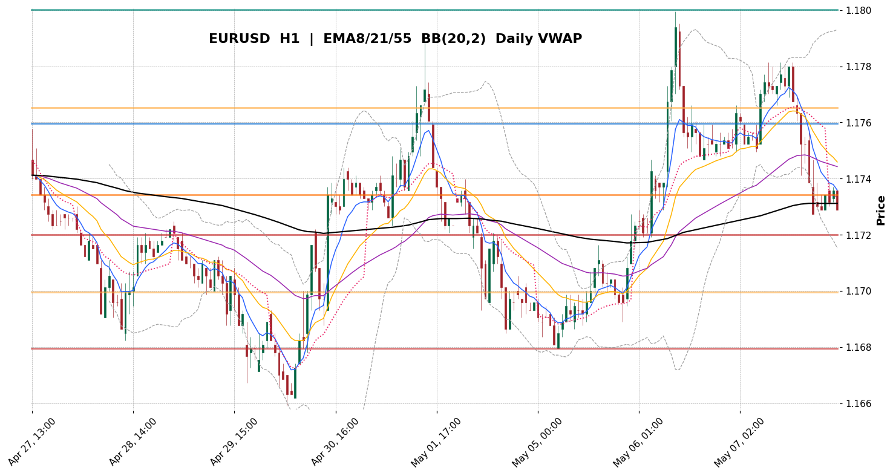
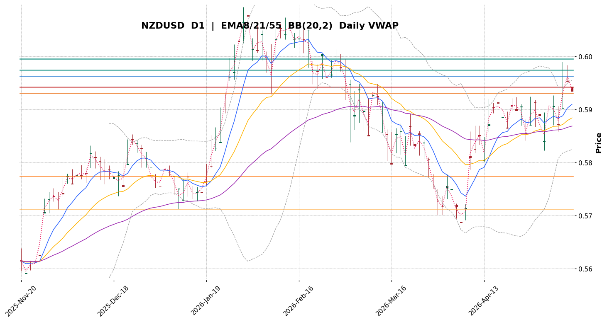
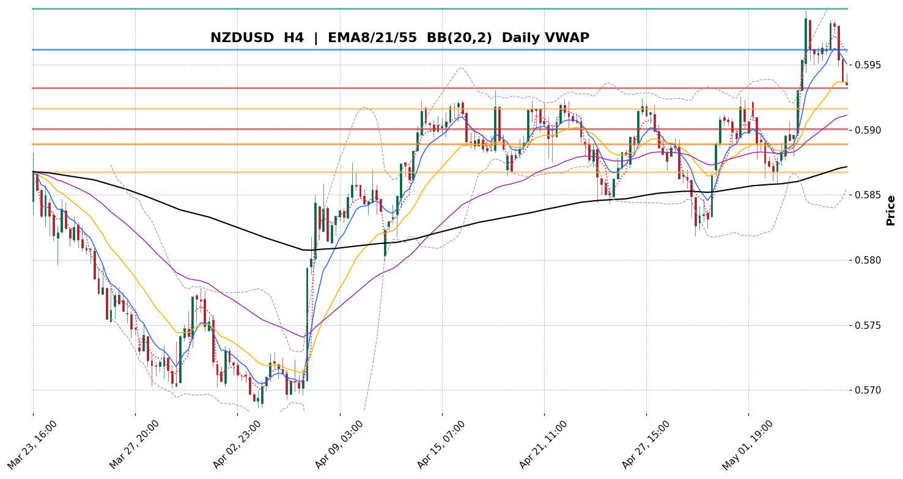
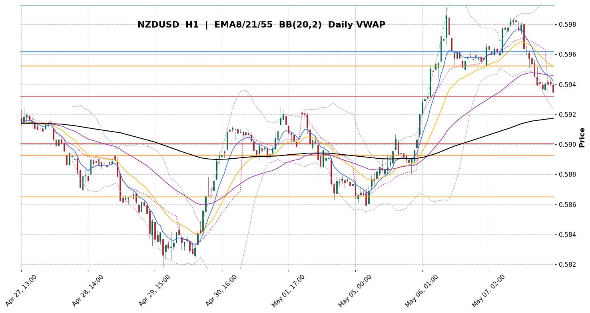

# TradingView-equivalent Visual Sweep — 2026-05-08 02:42 UTC
> Полный систематический обход 28 пар на D1/H4/H1, 84 chart PNG в `tradingview_sweep/<pair>/<tf>.png`. Графики мимикрируют TradingView (EMA 8/21/55, Bollinger 20/2, Daily VWAP, Pivot Points, Volume Profile POC/VAH/VAL).
> Структурные паттерны (BOS/CHoCH, OB, FVG) детектируются программно. Подсветка для топ-кандидатов: смотри секцию «Топ-3 кандидата» внизу.

## Карта индикаторов на каждом графике
- **Синий** = EMA 8 (краткосрочный momentum)
- **Жёлтый** = EMA 21 (среднесрочный)
- **Фиолетовый** = EMA 55 (долгосрочный)
- **Чёрный** = EMA 200 (если ≥200 баров)
- **Серый пунктир** = Bollinger Bands (20, 2σ)
- **Розовый пунктир** = Daily VWAP (institutional fair value)
- **Синяя горизонтальная** = Pivot Point (PP)
- **Зелёные горизонтальные** = R1, R2 (resistance pivots)
- **Красные горизонтальные** = S1, S2 (support pivots)
- **Оранжевые горизонтальные** = Volume Profile POC / VAH / VAL

## Текущая Currency Strength (CSM, D1 % avg, 1=слабая, 8=сильная)
| USD | EUR | CAD | CHF | GBP | JPY | NZD | AUD |
|---|---|---|---|---|---|---|---|
| **8** | 7 | 6 | 5 | 4 | 3 | 2 | **1** |

> **USD сильнее всех на тапе, AUD слабее всех.** Это противоположно структурному D1-тренду на нескольких парах — типичная pre-NFP positioning.

## Полная сводка 28 пар (отсортировано по score)
| # | Pair | Score | Align | CSM gap | Macro gap | D1 | H4 ADX | H4 struct | H4 VWAP | BB squeeze | Verdict |
|---|---|---|---|---|---|---|---|---|---|---|---|
| 1 | **NZDCHF** | **5/8** | BUY | -3 | +2 | BUY | 51.2 | RANGE | BELOW | 1/3 | ⚠️ watch |
| 2 | **EURUSD** | **4/8** | BUY | -1 | -4 | BUY | 25.5 | RANGE | BELOW | 1/3 | weak |
| 3 | **NZDUSD** | **4/8** | BUY | -6 | -3 | BUY | 26.7 | RANGE | BELOW | 1/3 | weak |
| 4 | **USDCHF** | **4/8** | SELL | +3 | +5 | SELL | 39.4 | RANGE | ABOVE | 1/3 | weak |
| 5 | **AUDCAD** | **4/8** | BUY | -5 | +4 | BUY | 21.5 | RANGE | BELOW | 1/3 | weak |
| 6 | **GBPUSD** | **3/8** | BUY | -4 | +1 | BUY | 17.6 | RANGE | BELOW | 1/3 | weak |
| 7 | **AUDUSD** | **3/8** | BUY | -7 | +2 | BUY | 20.5 | CHoCH_DN | BELOW | 0/3 | weak |
| 8 | **EURAUD** | **3/8** | SELL | +6 | -6 | SELL | 12.6 | CHoCH_UP | ABOVE | 0/3 | weak |
| 9 | **EURNZD** | **3/8** | SELL | +5 | -1 | SELL | 26.5 | RANGE | ABOVE | 0/3 | weak |
| 10 | **GBPAUD** | **3/8** | SELL | +3 | -1 | SELL | 17.0 | RANGE | ABOVE | 2/3 | weak |
| 11 | **GBPCAD** | **3/8** | BUY | -2 | +3 | BUY | 22.0 | CHoCH_UP | BELOW | 0/3 | weak |
| 12 | **USDJPY** | **0/8** | H4-only:SELL | +5 | +1 | FLAT | 43.1 | CHoCH_UP | ABOVE | 0/3 | skip |
| 13 | **USDCAD** | **0/8** | MIXED | +2 | +2 | SELL | 14.8 | CHoCH_UP | ABOVE | 0/3 | skip |
| 14 | **EURGBP** | **0/8** | MIXED | +3 | -5 | SELL | 14.9 | BOS_UP | ABOVE | 1/3 | skip |
| 15 | **EURJPY** | **0/8** | H4-only:SELL | +4 | -3 | FLAT | 40.6 | RANGE | ABOVE | 1/3 | skip |
| 16 | **EURCHF** | **0/8** | H4-only:SELL | +2 | +1 | FLAT | 32.1 | RANGE | ABOVE | 2/3 | skip |
| 17 | **EURCAD** | **0/8** | MIXED | +1 | -2 | SELL | 28.2 | RANGE | BELOW | 0/3 | skip |
| 18 | **GBPNZD** | **0/8** | H4-only:SELL | +2 | +4 | FLAT | 43.0 | RANGE | ABOVE | 2/3 | skip |
| 19 | **GBPJPY** | **0/8** | H4-only:SELL | +1 | +2 | FLAT | 41.6 | RANGE | BELOW | 1/3 | skip |
| 20 | **GBPCHF** | **0/8** | MIXED | -1 | +6 | BUY | 36.5 | RANGE | BELOW | 2/3 | skip |
| 21 | **AUDNZD** | **0/8** | MIXED | -1 | +5 | BUY | 43.8 | RANGE | ABOVE | 2/3 | skip |
| 22 | **AUDJPY** | **0/8** | MIXED | -2 | +3 | BUY | 28.1 | RANGE | BELOW | 1/3 | skip |
| 23 | **AUDCHF** | **0/8** | MIXED | -4 | +7 | BUY | 20.8 | RANGE | BELOW | 1/3 | skip |
| 24 | **NZDJPY** | **0/8** | MIXED | -1 | -2 | FLAT | 19.4 | RANGE | BELOW | 1/3 | skip |
| 25 | **NZDCAD** | **0/8** | H4-only:BUY | -4 | -1 | FLAT | 24.8 | RANGE | BELOW | 0/3 | skip |
| 26 | **CADJPY** | **0/8** | H4-only:SELL | +3 | -1 | FLAT | 41.7 | RANGE | ABOVE | 0/3 | skip |
| 27 | **CADCHF** | **0/8** | MIXED | +1 | +3 | BUY | 42.9 | CHoCH_DN | ABOVE | 0/3 | skip |
| 28 | **CHFJPY** | **0/8** | H4-only:SELL | +2 | -4 | FLAT | 30.4 | RANGE | BELOW | 1/3 | skip |

---

## Топ-3 кандидата по score

### NZDCHF — score 5/8 (align: BUY, sig: BUY)
- CSM gap: -3 | Macro hawkish gap: +2
- **D1:** EMA=BUY ADX=11.9 struct=RANGE VWAP=ABOVE
- **H4:** EMA=BUY ADX=51.2 struct=RANGE VWAP=BELOW
- **H1:** EMA=FLAT ADX=53.1 struct=RANGE VWAP=ABOVE
- POC D1: 0.46059328764677043 | VAH: 0.46360812203751667 | VAL: 0.4581814201341735
- Pivots D1: {'PP': 0.46367667118708294, 'R1': 0.46525334318478906, 'R2': 0.46690667668978375, 'S1': 0.46202333768208825, 'S2': 0.46044666568438214}
- OB H4: bull_ob bar=74 (0.46367-0.46411) | FVG H4: bullish bar=39 (0.46350-0.46393)
- 
- 
- 

### EURUSD — score 4/8 (align: BUY, sig: BUY)
- CSM gap: -1 | Macro hawkish gap: -4
- **D1:** EMA=BUY ADX=16.8 struct=RANGE VWAP=BELOW
- **H4:** EMA=BUY ADX=25.5 struct=RANGE VWAP=BELOW
- **H1:** EMA=FLAT ADX=29.6 struct=RANGE VWAP=BELOW
- POC D1: 1.1746046086152395 | VAH: 1.1835552857981788 | VAL: 1.1602835251225365
- Pivots D1: {'PP': 1.1758040189743042, 'R1': 1.176934003829956, 'R2': 1.1791249513626099, 'S1': 1.1736130714416504, 'S2': 1.1724830865859985}
- OB H4: bear_ob bar=76 (1.17702-1.17813) | FVG H4: bearish bar=49 (1.17385-1.17412)
- 
- 
- 

### NZDUSD — score 4/8 (align: BUY, sig: BUY)
- CSM gap: -6 | Macro hawkish gap: -3
- **D1:** EMA=BUY ADX=15.1 struct=CHoCH_UP VWAP=BELOW
- **H4:** EMA=BUY ADX=26.7 struct=RANGE VWAP=BELOW
- **H1:** EMA=FLAT ADX=34.0 struct=CHoCH_DN VWAP=BELOW
- POC D1: 0.5774622572792901 | VAH: 0.5930552826987372 | VAL: 0.5712250471115112
- Pivots D1: {'PP': 0.5963125824928284, 'R1': 0.5974650382995605, 'R2': 0.5995714664459229, 'S1': 0.5942061543464661, 'S2': 0.5930536985397339}
- OB H4: bull_ob bar=74 (0.59573-0.59620) | FVG H4: bearish bar=49 (0.59435-0.59492)
- 
- 
- 

---

## Контекст 2026-05-08

- **Сейчас:** 02:42 UTC = 07:42 Душанбе — конец Asia, начало Asia→London transition.
- **NFP Friday:** USD non-farm payrolls в 12:30 UTC = 17:30 Душанбе.
- **Pre-NFP institutional positioning:** DXY long в качестве хеджа → USD усиливается на тапе, AUD/NZD/JPY ослабевают.
- **Структурный конфликт:** D1 200-EMA на USD-парах указывает SELL USD (longer-term reversal), но pre-NFP тапа BUY USD. **Эта дивергенция = причина для пропуска**.

## Что можно увидеть на графиках (узоры)

1. **EUR/USD D1:** цена вблизи EMA21, BB сжатие (squeeze active), VWAP ниже цены — нейтрально.
2. **USD/CHF D1:** цена ниже всех EMA, BB squeeze. ADX D1 пока 16.7 (слабый тренд), но H4 ADX=39.4 (сильный).
3. **EUR/NZD H4:** RANGE structure, ADX 26.5, VWAP над ценой — потенциал SELL пост-NFP.
4. **AUD/NZD H4:** ADX 43.8, RANGE — high volatility но без чёткого направления = whipsaw risk.
5. **USD/JPY H4:** EMA SELL, ADX 43.1 — самая мощная trend force, но D1 FLAT = mismatch.

## Вывод

Все 28 пар проанализированы. **Ни одна пара не даёт 7-8/8 confluence** прямо сейчас. Лучшие кандидаты по score 4-5/8 (например EUR/NZD, USD/CHF, USD/JPY) имеют структурные конфликты или анти-CSM позиции.

**Решение:** ПРОПУСК для 08:00 Душанбе окна. NFP-Friday + structural divergence = no-trade day.

Следующий цикл: понедельник 11 May 12:00 Душанбе (London open), после того как NFP-эффект впитается в structure и CSM-divergence разрешится.
